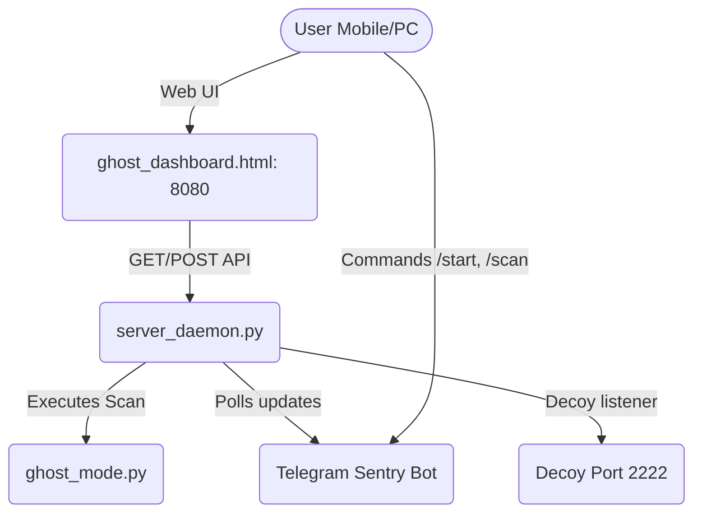

# 💀 Aether Ghost OS — Developer Contribution & Architecture Guide

Welcome to the development team! This guide explains the core architecture of the Aether Ghost OS ecosystem, recent updates/fixes, and contains a list of suggested tasks matched to your backend, Python, and frontend skill sets.

---

## 🗺️ System Architecture

Aether Ghost OS is a lightweight, local-first privacy suite designed to run in sandboxed user-space (such as Android via Termux, Linux, and Windows). It consists of three primary components:



### 1. The Threat Scanner: `ghost_mode.py`
A modular Python security auditing script that runs one-off diagnostic checks:
- **Port Scanner:** Audits open system ports.
- **Cam/Mic monitor:** Monitors the logcat buffer (Android) or running process trees to detect active recording sessions.
- **ARP/SSID auditor:** Detects address resolution spoofing and open Wi-Fi configurations.
- **DNS Leak check:** Validates that name resolution is safely routed.

### 2. The Daemon Server: `ghost_tools/server_daemon.py`
A background HTTP server (port `8080`) that coordinates all active services:
- Serves the frontend visual dashboard.
- Maintains an asynchronous background loop that triggers `ghost_mode.py` diagnostic scans.
- Handles automated connection health checks and failovers (Tor -> WARP -> Proxy -> DoH).
- Hosts a TCP socket honeypot listener on port `2222` to detect local network scanning.
- Runs the **Sentry Bot Poller** for remote management.

### 3. The Visual Control Console: `ghost_tools/ghost_dashboard.html`
A responsive, premium HTML dashboard styled with vanilla CSS:
- Polls real-time JSON updates from `/api/engine-status`, `/api/report`, and `/api/logs`.
- Controls system DNS configurations and anonymity engines dynamically.

---

## 🛠️ Recent Fixes & Milestones

We have recently completed these major stabilization steps:
* **Termux Whitelisting:** Filtered standard system processes (`ssh-agent`, `runsv`, `sshd`) from being flagged as active threats.
* **Tor Verification Upgrade:** Replaced static IP comparison with direct validation via the `check.torproject.org` API to handle global VPN routing correctly.
* **Non-Blocking Telemetry Polling:** Upgraded the Telegram Sentry Bot poller inside the daemon to run asynchronous scan requests without blocking or freezing other commands.
* **UX Improvements:** Implemented auto-saving for Telegram configurations whenever a user performs a successful "Test Sentry" hook from the dashboard.

---

## 🎯 Task Board (For Your Skills)

Here are the features we want to build next. Choose one of these to work on!

### Task 1: Robust Log Rotation Framework (Python / Backend)
- **Goal:** Currently, logs are written to `ghost.log` indefinitely. We need a lightweight log rotation system that limits the log size to `2MB` to prevent storage issues on phones.
- **Suggested Implementation:** Update `log_message` in `server_daemon.py` to check file size and rotate the log if it exceeds the limit (keeping up to 3 backup segments, e.g. `ghost.log.1`).

### Task 2: Custom Process Whitelist Editor (Python / Automation)
- **Goal:** Let users add custom application signatures to the process whitelist directly from the dashboard or Sentry bot.
- **Suggested Implementation:** Load/save whitelisted process names from a JSON configuration file rather than hardcoding them in `ghost_mode.py`.

### Task 3: Unit Testing Suite (Python / Testing)
- **Goal:** Build robust offline mock tests to verify that `ghost_mode.py` diagnostics work correctly.
- **Suggested Implementation:** Create a `tests/` directory with pytest scripts mocking subprocess outputs for `check_dns_leak` and `check_arp`.

---

## 🚀 Getting Started

1. **Fork the repository:** Fork this public repository to your GitHub profile.
2. **Clone your fork:**
   ```bash
   git clone https://github.com/YOUR_USERNAME/ghost-mode.git
   cd ghost-mode
   ```
3. **Run local server:**
   ```bash
   python ghost_tools/server_daemon.py
   ```
4. **Open control panel:** Navigate to `http://localhost:8080` in your web browser.
5. **Create a branch:** Make your changes on a separate feature branch and submit a Pull Request!
